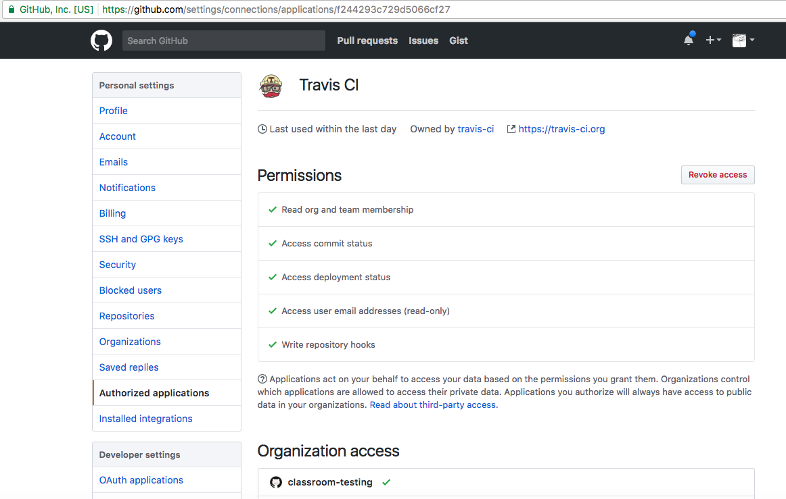
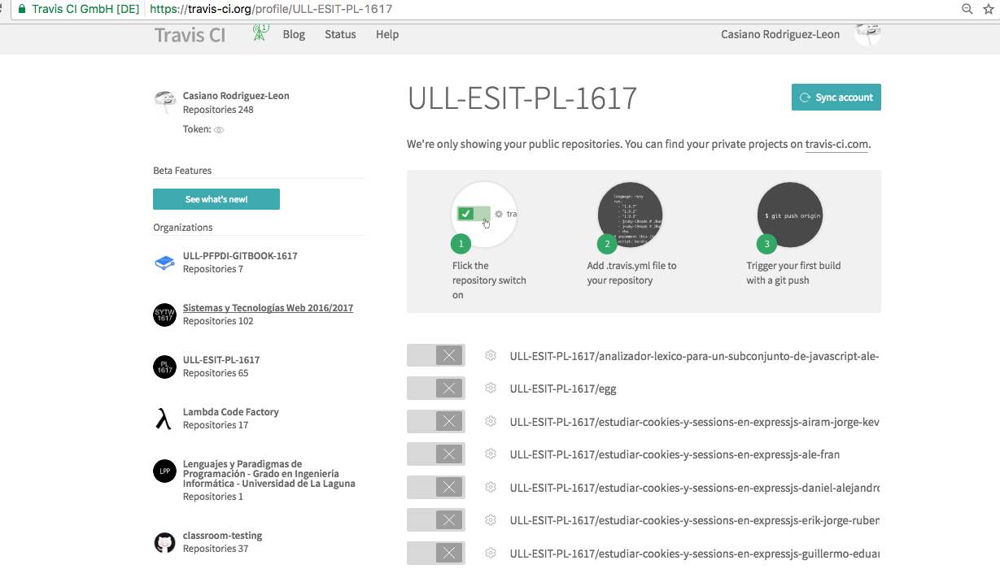
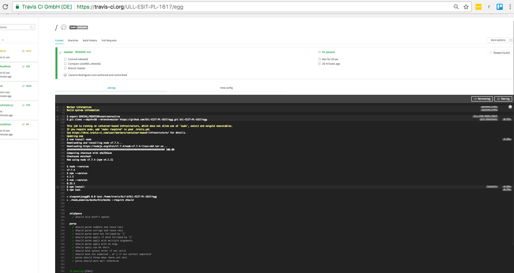

## Travis

* [https://travis.ci.org](https://travis-ci.org/)
* [Tu página de perfil en Travis](https://travis-ci.org/profile)

### Autorizando a Travis

1. Nos vamos a nuestra página de perfil en Travis
  - 
2. Autorizamos en GitHub a Travis para que acceda a nuestras organizaciones y repos
  - 
  
  
### Buscando los repos de una organización

1. Si en la página de perfil hacemos click en una organización veremos los repos públicos de esa organización (los repos privados aparecen en [travis-ci.com](https://travis-ci.com/) que es de pago)
  -  
2. Si hacemos click en un repo vemos el resultado de las pruebas de la última construcción en los servidores de Travis 
3. La URL para ver los repos de una organización es `https://travis-ci.org/profile/organization`
4. Haciendo click en un repo vamos a los resultados de las pruebas en los servidores de Travis para ese repo
  - 

### Documentación

* [Travis CI for Complete Beginners](https://docs.travis-ci.com/user/for-beginners)
* [Travis CI: Building a Node.js project](https://docs.travis-ci.com/user/languages/javascript-with-nodejs/)
* [Apuntes de Ruby del profesor: Travis](http://crguezl.github.io/apuntes-ruby/node326.html)
* [El cliente Travis de línea de comandos](https://github.com/travis-ci/travis.rb)

#### Como hacer un Badge Travis
Para hacer un badge vaya a la página Travis de pruebas del repositorio y haga click en el botón *build/passing* arriba a la derecha: se abrirá un formulario. Rellénelo de manera adecuada y le indicará el Markdown que debe insertar en su `README.md`

